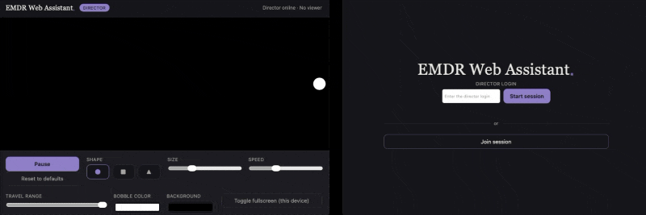

# EMDR Web Assistant (The Window Sill)

A NodeJS port of the Unity EMDR Assistant app. One person joins as the **director** and controls shape, color, size, speed, travel range, background color, beep-on-bounce, and play/pause. The client can then join as a **viewer** and watch the same bobble, in sync, in real time.



Written in TypeScript, strict mode, with a shared, type-checked message protocol between the server and browser client (details below).

## Running

Requires Node.js (v18+) and npm.

```bash
npm install
npm start
```

`npm start` builds the TypeScript (server + client) and then runs the compiled server. Open `http://localhost:3000` in a browser.

By default the director passphrase is `director` — change it before deploying:

```bash
DIRECTOR_PASSPHRASE="something only you know" PORT=8080 npm start
```

Note: The director login uses the browser's native Web Crypto API, which browsers only expose in a secure context. Logging in as director will fail with a clear message if you deploy over plain HTTP on a LAN IP or a domain without TLS.

### Other Scripts

```bash
npm run typecheck   # type-check both the server and client, no output files
npm run build       # compile server -> dist/, client -> public/client/ and public/shared/
```

There's no dev-server/watch tooling added to keep the overall package dependency-light.  For iterating, two terminals with Node's built-in watch flag works well:

```bash
npx tsc -p tsconfig.server.json --watch    # terminal 1
node --watch dist/server.js                # terminal 2 (also rebuild the client on change)
```

## Simple Deployment

Copy the whole folder (or just `src/`, `public/index.html`, `public/style.css`, the `tsconfig*.json` files, and `package.json`) to any host that can run Node — a small VPS, Render, Railway, Fly.io, a Raspberry Pi, etc. Run `npm install && npm start` (or `npm run build` once, then `node dist/server.js` directly, and keep it alive with `pm2` / `systemd`).

Nothing is persisted to disk — all settings reset to defaults each time the server process restarts.

Platforms like Render/Railway/Fly will handle 'keep it running' and the public URL — point them at the repo and they figure out `npm install`/`npm start`. If you're putting this on a server you already administer (e.g. Nginx or Apache), there are two separate jobs: 
1. keeping the Node process running continuously in the background
2. telling your existing web server to forward requests to it

See [below](#deploying-behind-an-existing-nginx-or-apache) for a setup guide for this case.

## Project Layout

```
src/
  server.ts             Slim composition root: wires config/rooms/connections/router together
  server/
    config.ts             Env-derived config (PORT, DIRECTOR_PASSPHRASE, MAX_ROOMS, EMPTY_ROOM_TEARDOWN_MINUTES)
    auth.ts                HMAC-SHA256 challenge-response verification
    bobble-session.ts      Bobble's physics state + applyControl (one instance per room)
    connections.ts         WebSocketServer + room-agnostic per-connection bookkeeping (nonce, failed attempts, which room)
    room-connections.ts     Per-room director seat + viewer roster + room-scoped broadcast
    room.ts                 Room's BobbleSession + RoomConnections + teardown timer
    room-manager.ts         Room lookup/create, empty-room teardown, max-rooms eviction
    logger.ts               JSON-lines event log (room/director/viewer lifecycle) to stdout
    message-router.ts       Parse incoming frames and route them to the right room's session + connections
  shared/
    types.ts             WebSocket message protocol & session-state types
    validate.ts           Runtime type guards for messages coming off the wire
    rooms.ts               Room-name validation/normalization, shared by client and server
    motion.ts               Bounce/ramp position math
  client/
    client.ts             Slim composition root: wires connection/renderer/controller together
    connection.ts           WebSocket lifecycle (connect/reconnect/send, heartbeat ping/pong)
    dom.ts                   Typed element lookups
    renderer.ts               Per-frame paint loop
    beep.ts                    Web Audio beep-on-bounce (stereo-panned oscillator, one-shot)
    crypto.ts                  HMAC login digest via the Web Crypto API
    settings-file.ts            Settings file format: serialize/parse/validate (pure data, no browser APIs)
    file-io.ts                   Native save/open file-picker mechanics
    session-controller.ts          Orchestrator: wires dom + connection + renderer together
public/
  index.html            Landing screen + session screen markup
  style.css             Styling
  client/, shared/       *Generated* by `npm run build` — not committed
dist/                   *Generated* — the compiled server
tsconfig.base.json      Shared strict compiler options
tsconfig.server.json    Node/CommonJS build (src/server.ts + src/server/* + src/shared/*)
tsconfig.client.json    Browser/ESM build (src/client/* + src/shared/*)
```

`dist/` and `public/client/`, `public/shared/` are build output (see `.gitignore`) — don't hand-edit files there, they get overwritten by `npm run build`.

## High-Level Notes on Architecture

Both sides follow the same shape:

Narrowly-scoped modules underneath a small orchestrator, underneath a slim composition-root entry
point that  wires them together and starts things up:

**Server** (`src/server.ts` wires these three together):
- `BobbleSession` — owns the bobble's state and the rules for mutating it
- `ConnectionRegistry` — owns the WebSocket client set /roles, and each connection's current auth nonce + failed-attempt count
- `DirectorAuth` — issues nonces, verifies a login digest
- `MessageRouter` — the only module that knows about both of the above:
  parses/validates incoming frames, decides what they mean, and composes
  the broadcasted `PublicState` from `BobbleSession` + `ConnectionRegistry`

**Client** (`src/client/client.ts` wires these three together):
- `ServerConnection` — owns the raw WebSocket (connect, reconnect, parse,
  send)
- `BobbleRenderer` — owns the per-frame paint loop - pure function of
  whatever `{ state, now, visible }` that it's handed each frame
- `SessionController` — the only module that knows about `dom.ts`,
  `ServerConnection`, and `BobbleRenderer` all at once: wires UI events to
  outgoing messages, reflects incoming state onto the UI, and feeds the
  renderer

### Q:  Why two separate tsconfigs?

The server runs on Node (CommonJS, no DOM) and the client runs in the browser as a native ES module (`<script type="module">`, no bundler) — two different runtimes with different `lib`/`module` needs, so they're two separate `tsc` invocations sharing one `tsconfig.base.json` for the actual strictness settings. `src/shared/*.ts` has zero Node- or DOM-specific APIs, so it gets compiled twice (once per target) from the same source — the bounce/ramp math and the message-protocol types are written exactly once, not duplicated between server and client.

`tsconfig.json` at the root doesn't compile anything itself (`"files": []`), it just `references` the two leaf configs. Editors discover a project's settings by walking up from an open file to the nearest `tsconfig.json`, and having only `tsconfig.server.json`/
`tsconfig.client.json` (no plain `tsconfig.json`) means an editor may not find either one and fall back to an inferred default project with different defaults.  This can produce confusing type errors that don't reproduce when you actually run `npm run typecheck`. One side effect: composite mode requires declaration output, so you'll see `.d.ts` files alongside the compiled `.js` in `dist/`/`public/client/`/`public/shared/`.

Note also that `tsconfig.server.json` sets `"module": "Node16"` / `"moduleResolution": "Node16"` (not the older `"moduleResolution": "Node"`). `Node16` mode still emits plain CommonJS.  This is purely a function of `package.json` having no `"type": "module"` field, but is also a requirement re: relative imports to include their extension (e.g. `from './server/config.js'`).

## Basic Functionality Overview

- **Server (`server.ts`)** holds the one authoritative session: current shape/color/size/speed/range/background/running/beep state, plus an "anchor" (a position + direction + instantaneous speed + timestamp) it can use to analytically compute bobble speed/position at any later moment. 
  - This mirrors `BobbleMover.cs`'s ping-pong motion and its speed-ramp easing, expressed as a closed-form formula (a piecewise ramp-then-constant speed profile, integrated to get distance) instead of a per-frame physics step, so the server never needs to run a game loop.
- Only one WebSocket connection can hold the **director** role at a time. If the director disconnects, the bobble keeps doing whatever it was doing, and the seat is free to reclaim.
- The other connection is a **viewer**: read-only, gets the live state and renders the same motion locally using the same shared `computeAt` formula, so all screens track closely without the server streaming a position every frame.
- State changes (color, shape, size, speed, range, beep on/off, beep frequency, play/pause, reset) are broadcast to everyone instantly over WebSocket.

## Beep on Bounce

The director can turn on a short beep (100–2000 Hz, configurable) that plays whenever the bobble reaches either edge and changes direction.

`beepOnBounce` and `beepFrequency` are two fields in the same synced `SessionState`/`PublicState` as shape/color/size/etc. The beep itself is never sent over the wire. Each client's `renderer.ts` independently notices when its own local position hits an extent, and fires a local Web Audio oscillator (`beep.ts`). Since every client is computing the same motion from the same anchor, they beep in sync without the server ever broadcasting a "bounce happened" event.

Browsers only allow audio to start from inside a user gesture, so `BeepPlayer.unlock()` is called synchronously inside the join-session click handler, before anything `async` happens — calling it any later (e.g. after an `await`) silently fails to produce sound in some browsers.

## Connection Keepalive & Auto-Reconnect

Every client sends a `{ type: 'ping' }` every 20s once connected and expects a `{ type: 'pong' }` back; if a previous ping never got answered by the time the next one is due, the client treats the socket as dead, closes it, and reconnects (1.5s later) rather than waiting for the browser/OS to eventually notice a half-open TCP connection on its own. This is what keeps a viewer or director from silently going stale after a laptop sleep, a flaky wifi handoff, or a proxy/load-balancer that drops idle connections after some corporate-default (e.g. 60s) idle timeout.

## Rooms (Multiple Simultaneous Sessions)

The server can host many independent sessions at once, each identified by a **Room** name. Note that there is still only one shared director passphrase (see below). Room names are trimmed and lower-cased to make them case-insensitive, such that, e.g., `"Room1"`, `"room1"`, and `" room1 "` are all the same room.

- **Director**: entering a Room name and the correct passphrase either joins that room's existing session (kicking out its current director), or starts a new room if no session exists under that name
- **Viewer**: entering a Room name joins that room's session if one already exists

**Each room has its own bobble state, its own director seat, and its own viewer roster — controls in one room never affect another.**

### Empty-Room Teardown

If every connection in a room (i.e. both director/viewer) disconnects, that room's state is kept alive for a grace period, then discarded:

```bash
EMPTY_ROOM_TEARDOWN_MINUTES=5   # default; a fresh join before this elapses cancels the teardown
```

### Room Cap

To bound memory/connection usage, only so many rooms can exist at once:

```bash
MAX_ROOMS=100   # default
```

If a new room would be created past this cap, the oldest existing room is torn down first — anyone still connected to it receives a `{ type: 'kicked' }` message.

### Logging

The server writes one JSON object per line to **stdout** — nowhere else. 

There's deliberately no log file or rotation to manage: this is meant to run on read-only/ephemeral hosting, where there's no writable, persistent disk to keep files on.

If you're self-hosting on a VM instead (see [Simple Deployment](#simple-deployment) below), your process manager captures stdout — `journalctl -u emdr-assistant` for systemd, `pm2 logs` for PM2 — and you can pipe that to a file with rotation on the host side if you want it kept longer than the process manager's own retention.

Events logged:

| Event                          | Fired when                                         | Fields                            |
| ------------------------------ | -------------------------------------------------- | --------------------------------- |
| `room_created`                 | a new room is created                              | `room`, `activeRooms`, `maxRooms` |
| `room_deleted`                 | a room is torn down (inactivity *or* cap eviction) | `room`, `reason`, `activeRooms`   |
| `director_joined`              | a director wins the seat in a room                 | `room`                            |
| `director_left`                | a director's connection leaves a room              | `room`                            |
| `director_replaced`            | a second director logs in and takes the seat       | `room`                            |
| `director_auth_failed`         | a passphrase attempt doesn't verify                | `room`, `attempts`                |
| `viewer_joined`                | a viewer joins a room                              | `room`                            |
| `viewer_left`                  | a viewer's connection leaves a room                | `room`                            |
| `server_start` / `server_stop` | the process starts up / shuts down                 | config values / `signal`          |

Every line also gets a `ts` (ISO-8601 timestamp) and `event` name. Example:

```json
{"ts":"2026-08-03T18:45:06.650Z","event":"room_deleted","room":"rooma","reason":"Room closed to make space for a new session.","activeRooms":0}
```

## Rendering Notes

### On Bobble Position Updates

`renderer.ts` necessarily positions the bobble via CSS `transform`->`translate(...)` (and not, e.g., via `left`/`top`). 

This is due to the fact that `left`/`top` require the browser to repaint pixels at the new position every frame, even on a promoted layer, while `transform` (like `opacity`) can be handled entirely by the compositor (moving an already-rasterized texture on the GPU). To this end, driving the animation instead with `left`/`top` can result in rendering artifacts due to sub-pixel repaint/dirty-rect rounding errors.

### On Per-Frame Work

`renderer.ts` deliberately avoids forced layout reads and unnecessary garbage-collector pressure to minimize the animation choppiness/jitter.

Notably:
- **The stage's size is measured once and cached**. 
  - Reading live layout geometry can force the browser to recompute layout if anything's pending (allocating a new `DOMRect` every call)
  - Thus, we only re-measure via a `ResizeObserver`, and once explicitly when the session view becomes visible
- **Shape/size/color-related DOM writes are skipped on any frame where none of them changed** 
  - Rewriting the same CSS values repeatedly still costs a style recalculation and allocates fresh template-literal strings each time
  - This steady allocation stream was observed to cause periodic GC-pause-driven micro-stutters

## Director Login

There's one shared passphrase (`DIRECTOR_PASSPHRASE`), not per-person accounts — this is intentionally lightweight and not a full auth system. 

### Auth / Crypto Logistics

On connecting, the server sends every client a random one-time nonce (`{ type: 'challenge' }`).  To log in, the browser computes `HMAC-SHA256(passphrase, nonce)` and sends only that digest. The server independently computes the same HMAC with its own copy of the passphrase and that connection's nonce, and compares in constant time.

### Director Seat

A correct login always wins the director seat, even from a second connection. There's no "sorry, someone's already directing" rejection — whoever most recently proved they know the passphrase gets the seat, and whoever held it before gets a `{ type: 'kicked' }` message and their connection closed. 

This lets a director whose connection went stale (closed laptop, network hiccup, flaky wifi) reclaim control by logging in again, rather than being locked out until the old socket happens to time out.

### Known Limitations

- After 5 wrong attempts on one connection, the socket is closed
  - This is scoped per-connection, not per-IP
  - reconnecting gets a fresh budget, so it slows down casual/scripted guessing, but isn't a real defense against a determined attacker
- There's no nonce expiry — a nonce is valid until it's used (successfully or not) or a new connection replaces it
- None of this protects the passphrase from being learned some other way (someone tells a friend, it's visible over someone's shoulder, etc.) — same as any shared-secret scheme

## Settings File (Save/Load)

The admin console has Save/Load buttons to locally save the bobble's tunable settings: shape, bobble color, background color, size, speed, travel range, beep on/off, and beep frequency.

Save format is plain JSON:

```json
{
  "formatVersion": 1,
  "shape": "circle",
  "bobbleColor": "#ffffff",
  "backgroundColor": "#000000",
  "size": 0.3,
  "speed": 0.35,
  "range": 1,
  "beepOnBounce": false,
  "beepFrequency": 440
}
```

## Content Security Policy

`server.ts` sets a `Content-Security-Policy` header on every response (see the `CONTENT_SECURITY_POLICY` constant). Currently allowlisted, beyond `'self'`:

| Directive     | Origins allowed                             | Why                                                                               |
| ------------- | ------------------------------------------- | --------------------------------------------------------------------------------- |
| `script-src`  | `canner.ca`, `api.canner.ca`                | Canner analytics + vitals scripts (see [Analytics](#analytics))                   |
| `style-src`   | `fonts.googleapis.com`                      | Fetches the Google Fonts CSS file (`<link rel="stylesheet">`)                     |
| `font-src`    | `fonts.gstatic.com`                         | The actual font binary files, which live on a different origin than the CSS above |
| `connect-src` | `ws:`, `wss:`, `api.canner.ca`, `canner.ca` | The app's own WebSocket, plus the analytics beacon                                |

**If you add any new third-party resource** (another font, an image CDN, a different analytics/embed script, a different WebSocket target, etc.), the browser will silently block it until its origin is added to the matching directive above.

## Analytics

`index.html` loads a small third-party analytics script from [Canner](https://canner.ca) (`t.js`, plus a `vitals.js` beacon), tagged with a site ID and a `data-domains` allowlist of the domains it should track on (currently `emdr-web-assistant.canner.app`, `thewindowsill.ca`, `www.thewindowsill.ca`). If the app is ever redeployed under a different domain, that `data-domains` attribute needs updating, or Canner will simply decline to record anything for the new domain.

## Deploying Behind an Existing Nginx or Apache 

**0. Get the code onto the server and build it once.**

```bash
git clone <repo-URL>
npm ci
npm run build
```

Pick a port only this app will use (examples below use `3000`) and a real passphrase.  Don't leave it as the default `director` on anything reachable by more than you.  Don't expose the Node process itself — only the reverse proxy needs to reach it over loopback.

```bash
# e.g. in /opt/emdr-assistant/.env, or set directly in the service files below
PORT=3000
HOST=127.0.0.1
DIRECTOR_PASSPHRASE="something only you know"
MAX_ROOMS=100
EMPTY_ROOM_TEARDOWN_MINUTES=5
```

**1. Keep it running: pick one.**

<details open>
<summary><strong>Option A — systemd</strong> (built into most Linux servers, survives reboots)</summary>

Create `/etc/systemd/system/emdr-assistant.service`:

```ini
[Unit]
Description=EMDR Web Assistant
After=network.target

[Service]
Type=simple
User=youruser
WorkingDirectory=/opt/emdr-assistant
Environment=PORT=3000
Environment=HOST=127.0.0.1
Environment=DIRECTOR_PASSPHRASE=something-only-you-know
ExecStart=/usr/bin/node dist/server.js
Restart=on-failure
RestartSec=3

[Install]
WantedBy=multi-user.target
```

Replace `youruser` with whichever non-root user should own the process, and fix `WorkingDirectory` if you cloned it somewhere else. 

Then:

```bash
sudo systemctl daemon-reload
sudo systemctl enable --now emdr-assistant
sudo systemctl status emdr-assistant
journalctl -u emdr-assistant -f
```

To pick up code changes later, run:

 `git pull && npm ci && npm run build && sudo systemctl restart emdr-assistant`.

</details>

<details>
<summary><strong>Option B — pm2</strong> (process manager built specifically for Node apps)</summary>

```bash
npm install -g pm2
```

Create `/opt/emdr-assistant/ecosystem.config.js`:

```js
module.exports = {
  apps: [
    {
      name: 'emdr-assistant',
      script: 'dist/server.js',
      env: {
        PORT: 3000,
        HOST: '127.0.0.1',
        DIRECTOR_PASSPHRASE: 'something-only-you-know',
      },
    },
  ],
};
```

Then:

```bash
cd /opt/emdr-assistant
pm2 start ecosystem.config.js
pm2 save # remember this process list
pm2 startup # run what it prints
```

Useful commands: `pm2 status`, `pm2 logs emdr-assistant`, `pm2 restart emdr-assistant`.

To pick up code changes later, run:

`git pull && npm ci && npm run build && pm2 restart emdr-assistant`.

</details>

**2. Point your existing web server at it.**

This app uses WebSockets (for the real-time sync between director and viewers), which need a couple of extra config lines beyond a normal reverse proxy.  Without them, the page will load but the "Start session"/"Join session" buttons will silently do
nothing, since the WebSocket connection never completes.

<details open>
<summary><strong>Nginx</strong></summary>

Add a server block (in `/etc/nginx/sites-available/`, or wherever your existing sites are configured — e.g. `/etc/nginx/sites-available/emdr-assistant`, then symlink it into `sites-enabled`):

```nginx
server {
    listen 80;
    server_name emdr-assistant.example.com;

    location / {
        proxy_pass http://127.0.0.1:3000;
        proxy_http_version 1.1;
        proxy_set_header Upgrade $http_upgrade;
        proxy_set_header Connection "upgrade";
        proxy_set_header Host $host;
        proxy_set_header X-Real-IP $remote_addr;
        proxy_set_header X-Forwarded-For $proxy_add_x_forwarded_for;
        proxy_set_header X-Forwarded-Proto $scheme;
    }
}
```

```bash
sudo nginx -t
sudo systemctl reload nginx
```

</details>

<details>
<summary><strong>Apache</strong></summary>

Enable the required modules (only needed once):

```bash
sudo a2enmod proxy proxy_http proxy_wstunnel rewrite
```

Add a virtual host (in `/etc/apache2/sites-available/emdr-assistant.conf`, then
`sudo a2ensite emdr-assistant`):

```apache
<VirtualHost *:80>
    ServerName emdr-assistant.example.com

    ProxyPreserveHost On

    RewriteEngine On
    RewriteCond %{HTTP:Upgrade} websocket [NC]
    RewriteCond %{HTTP:Connection} upgrade [NC]
    RewriteRule ^/?(.*) "ws://127.0.0.1:3000/$1" [P,L]

    ProxyPass / http://127.0.0.1:3000/
    ProxyPassReverse / http://127.0.0.1:3000/
</VirtualHost>
```

```bash
sudo apache2ctl configtest   # (RHEL/CentOS: httpd -t)
sudo systemctl reload apache2   # (RHEL/CentOS: systemctl reload httpd)
```

</details>

**3. Add HTTPS.** The director login specifically needs it — see the note under "Running it" above (viewers work fine without it, but logging in as director will fail on plain HTTP over a real domain).

**4. Firewall.** Make sure port `3000` (or whatever you picked) is **not** opened externally — only Nginx/Apache should reach it, over `127.0.0.1`, which is what `HOST=127.0.0.1` above enforces even if a firewall rule is ever misconfigured. If you're using `ufw`, something like `sudo ufw allow 'Nginx Full'` (or the Apache equivalent) for ports 80/443 is normally enough; you shouldn't need to touch port 3000 at all.

**5. Test it:** open `https://emdr-assistant.example.com` in a browser, join as director, and confirm the bobble responds to the controls. Then open the same URL in a second tab/device and join as viewer to confirm sync.
